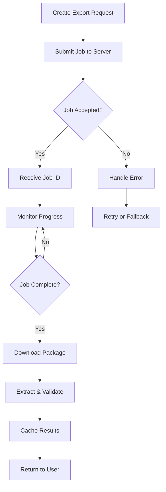

# Export Job Handling Specification
## Detailed Implementation Guide for Export Services

### Overview

The Export Job system is a critical component that handles asynchronous export operations from ShareDo servers. This specification details the complete implementation requirements for robust, efficient, and user-friendly export functionality.

---

## Export Job Lifecycle



---

## Core Export Service Implementation

### 1. Export Job Manager

```typescript
interface IExportJobManager {
  // Job Creation
  createJob(params: IExportParams): Promise<IExportJob>;
  createBatchJobs(params: IBatchExportParams): Promise<IExportJob[]>;
  
  // Job Monitoring
  monitorJob(jobId: string, options?: IMonitorOptions): Promise<IExportResult>;
  getJobStatus(jobId: string): Promise<IJobStatus>;
  cancelJob(jobId: string): Promise<void>;
  
  // Job Recovery
  retryFailedJob(jobId: string): Promise<IExportJob>;
  recoverInterruptedJobs(): Promise<IExportJob[]>;
}

interface IExportParams {
  type: 'worktype' | 'workflow' | 'form' | 'configuration';
  systemName: string;
  environment: string;
  options?: {
    includeDependencies?: boolean;
    includeHistory?: boolean;
    format?: 'json' | 'zip';
    compression?: 'none' | 'gzip' | 'brotli';
  };
}

interface IExportJob {
  id: string;
  type: string;
  status: 'pending' | 'running' | 'completed' | 'failed';
  createdAt: Date;
  startedAt?: Date;
  completedAt?: Date;
  progress: number;
  currentStep?: string;
  error?: string;
  resultUrl?: string;
}
```

### 2. Progress Monitoring System

```typescript
class ExportProgressMonitor {
  private pollInterval = 1000; // 1 second
  private maxPolls = 120;      // 2 minutes max
  private exponentialBackoff = false;
  
  async monitorWithProgress(
    jobId: string,
    client: IShareDoClient,
    callbacks?: IProgressCallbacks
  ): Promise<IExportResult> {
    const startTime = Date.now();
    let pollCount = 0;
    let lastProgress = 0;
    
    while (pollCount < this.maxPolls) {
      try {
        const status = await this.getJobStatus(jobId, client);
        
        // Progress callback
        if (status.percentage > lastProgress) {
          callbacks?.onProgress?.(status.percentage, status.currentStep);
          lastProgress = status.percentage;
        }
        
        // State handling
        switch (status.state) {
          case 'COMPLETED':
            callbacks?.onComplete?.();
            return await this.downloadResults(jobId, client);
            
          case 'FAILED':
            callbacks?.onError?.(new Error(status.error));
            throw new ExportFailedError(status.error);
            
          case 'RUNNING':
            // Check for stalled progress
            if (this.isStalled(status, startTime)) {
              callbacks?.onStalled?.();
            }
            break;
        }
        
        // Adaptive polling
        await this.adaptiveDelay(pollCount, status.percentage);
        pollCount++;
        
      } catch (error) {
        if (this.isRetryableError(error)) {
          await this.delay(this.getBackoffDelay(pollCount));
        } else {
          throw error;
        }
      }
    }
    
    throw new ExportTimeoutError(`Export job ${jobId} timed out after ${pollCount} attempts`);
  }
  
  private adaptiveDelay(pollCount: number, progress: number): Promise<void> {
    // Fast polling initially and near completion
    if (pollCount < 5 || progress > 90) {
      return this.delay(500);
    }
    
    // Slower polling during main processing
    if (progress < 50) {
      return this.delay(2000);
    }
    
    return this.delay(1000);
  }
  
  private isStalled(status: IJobStatus, startTime: number): boolean {
    const elapsed = Date.now() - startTime;
    const expectedTime = this.estimateCompletionTime(status);
    return elapsed > expectedTime * 2;
  }
}
```

### 3. Package Download Service

```typescript
class PackageDownloadService {
  private readonly chunkSize = 1024 * 1024; // 1MB chunks
  private readonly maxRetries = 3;
  
  async downloadPackage(
    jobId: string,
    client: IShareDoClient,
    destination?: string
  ): Promise<IDownloadResult> {
    const tempDir = destination || this.getTempDirectory();
    const packagePath = path.join(tempDir, `export_${jobId}.zip`);
    
    try {
      // Stream download with progress
      const response = await this.initiateDownload(jobId, client);
      const totalSize = parseInt(response.headers['content-length'], 10);
      
      await this.streamToFile(response.data, packagePath, {
        onProgress: (downloaded) => {
          const percent = Math.round((downloaded / totalSize) * 100);
          this.emit('downloadProgress', { percent, downloaded, totalSize });
        }
      });
      
      // Validate downloaded file
      await this.validatePackage(packagePath);
      
      return {
        packagePath,
        size: totalSize,
        checksum: await this.calculateChecksum(packagePath)
      };
      
    } catch (error) {
      // Cleanup on error
      await this.cleanup(packagePath);
      throw new DownloadError(`Failed to download package: ${error.message}`);
    }
  }
  
  private async validatePackage(packagePath: string): Promise<void> {
    // Check file exists and has size
    const stats = await fs.promises.stat(packagePath);
    if (stats.size === 0) {
      throw new ValidationError('Downloaded package is empty');
    }
    
    // Verify it's a valid ZIP
    try {
      const zip = new AdmZip(packagePath);
      const entries = zip.getEntries();
      
      // Check for required files
      const hasManifest = entries.some(e => e.entryName === 'manifest.json');
      if (!hasManifest) {
        throw new ValidationError('Package missing manifest.json');
      }
    } catch (error) {
      throw new ValidationError(`Invalid package format: ${error.message}`);
    }
  }
}
```

### 4. Package Extraction & Processing

```typescript
class PackageExtractor {
  async extractAndProcess(
    packagePath: string,
    options?: IExtractionOptions
  ): Promise<IExtractedData> {
    const extractDir = options?.destination || this.getExtractionDirectory();
    
    try {
      // Extract ZIP
      const zip = new AdmZip(packagePath);
      zip.extractAllTo(extractDir, true);
      
      // Parse manifest
      const manifestPath = path.join(extractDir, 'manifest.json');
      const manifest = await this.parseManifest(manifestPath);
      
      // Process components based on manifest
      const components = await this.processComponents(manifest, extractDir);
      
      // Organize data structure
      const organizedData = this.organizeData(components, manifest);
      
      // Cleanup if requested
      if (options?.cleanup) {
        await this.cleanup(extractDir, packagePath);
      }
      
      return organizedData;
      
    } catch (error) {
      // Ensure cleanup on error
      await this.cleanup(extractDir, packagePath);
      throw new ExtractionError(`Failed to extract package: ${error.message}`);
    }
  }
  
  private async processComponents(
    manifest: IManifest,
    extractDir: string
  ): Promise<IComponentMap> {
    const components: IComponentMap = {
      workTypes: [],
      workflows: [],
      forms: [],
      optionSets: [],
      permissions: [],
      templates: []
    };
    
    for (const step of manifest.ExportedSteps) {
      const filePath = path.join(extractDir, step.StorageFilename);
      const content = await fs.promises.readFile(filePath, 'utf8');
      const data = JSON.parse(content);
      
      // Route to appropriate component array
      switch (step.ExportProviderSystemName) {
        case 'sharedo-type':
          components.workTypes.push(this.transformWorkType(data));
          break;
        case 'sharedo-workflow':
          components.workflows.push(this.transformWorkflow(data));
          break;
        case 'sharedo-form':
          components.forms.push(this.transformForm(data));
          break;
        // ... other types
      }
    }
    
    return components;
  }
}
```

### 5. Export Operations (No Caching)

```typescript
/**
 * IMPORTANT: Export operations do NOT use caching to ensure fresh data
 * Each export request retrieves the latest configuration from the server
 */
class ExportService {
  // No cache - always fetch fresh data
  
  async exportWorkType(
    type: string,
    systemName: string,
    clientEnvironment: string
  ): Promise<IExportedData> {
    // Always make a fresh request to the server
    // No caching mechanism to ensure latest data
    console.log(`Fetching fresh export for ${clientEnvironment}:${systemName}`);
    
    const job = await this.createExportJob({
      type,
      systemName,
      environment: clientEnvironment,
      noCache: true  // Explicit no-cache flag
    });
    
    const result = await this.monitorJob(job.id);
    
    // Return fresh data without storing in cache
    return this.processExportData(result);
  }
  
  async compareExports(
    type: string,
    systemName: string,
    clientEnv1: string,  // e.g., "clientA-vnext"
    clientEnv2: string   // e.g., "clientB-uat"
  ): Promise<IComparisonResult> {
    // Fetch fresh data for both environments
    const [export1, export2] = await Promise.all([
      this.exportWorkType(type, systemName, clientEnv1),
      this.exportWorkType(type, systemName, clientEnv2)
    ]);
    
    return this.compareExportData(export1, export2, {
      env1: clientEnv1,
      env2: clientEnv2
    });
  }
  
  /**
   * Temporary file management for downloads
   * Files are cleaned up after processing
   */
  private async withTempDirectory<T>(
    operation: (tempDir: string) => Promise<T>
  ): Promise<T> {
    const tempDir = await fs.promises.mkdtemp(
      path.join(os.tmpdir(), 'sharedo-export-')
    );
    
    try {
      return await operation(tempDir);
    } finally {
      // Always cleanup temp files
      await fs.promises.rm(tempDir, { recursive: true, force: true });
    }
  }
}
```

---

## Error Handling Strategy

### Error Types

```typescript
enum ExportErrorCode {
  JOB_CREATION_FAILED = 'EXPORT_001',
  JOB_TIMEOUT = 'EXPORT_002',
  JOB_FAILED = 'EXPORT_003',
  DOWNLOAD_FAILED = 'EXPORT_004',
  EXTRACTION_FAILED = 'EXPORT_005',
  VALIDATION_FAILED = 'EXPORT_006',
  NETWORK_ERROR = 'EXPORT_007',
  AUTHENTICATION_ERROR = 'EXPORT_008'
}

class ExportError extends Error {
  constructor(
    message: string,
    public code: ExportErrorCode,
    public details?: any,
    public recoverable = false
  ) {
    super(message);
  }
}
```

### Recovery Strategies

```typescript
class ExportRecoveryService {
  async handleExportError(
    error: ExportError,
    context: IExportContext
  ): Promise<IRecoveryResult> {
    switch (error.code) {
      case ExportErrorCode.JOB_TIMEOUT:
        return await this.retryWithExtendedTimeout(context);
        
      case ExportErrorCode.NETWORK_ERROR:
        return await this.retryWithBackoff(context);
        
      case ExportErrorCode.AUTHENTICATION_ERROR:
        await this.refreshAuthentication(context);
        return await this.retry(context);
        
      case ExportErrorCode.JOB_FAILED:
        // Try alternative export method
        return await this.tryAlternativeExport(context);
        
      default:
        throw error; // Non-recoverable
    }
  }
  
  private async tryAlternativeExport(
    context: IExportContext
  ): Promise<IRecoveryResult> {
    // Fall back to configuration export API
    console.log('Primary export failed, trying configuration export API...');
    
    try {
      const result = await this.configurationExport(
        context.workType,
        context.environment
      );
      
      return {
        success: true,
        method: 'configuration-export',
        data: result
      };
    } catch (fallbackError) {
      return {
        success: false,
        error: new ExportError(
          'All export methods failed',
          ExportErrorCode.JOB_FAILED,
          { primary: context.error, fallback: fallbackError }
        )
      };
    }
  }
}
```

---

## Batch Export Operations

```typescript
class BatchExportService {
  private readonly maxConcurrent = 5;
  private readonly queue = new PQueue({ concurrency: this.maxConcurrent });
  
  async batchExport(
    items: IExportItem[],
    options?: IBatchExportOptions
  ): Promise<IBatchExportResult> {
    const results: IExportResult[] = [];
    const errors: IExportError[] = [];
    
    // Progress tracking
    const progress = new ProgressTracker(items.length);
    
    // Queue all export jobs
    const promises = items.map((item, index) => 
      this.queue.add(async () => {
        try {
          const result = await this.exportSingle(item, options);
          results.push(result);
          progress.increment();
          
          options?.onItemComplete?.(item, result, index);
        } catch (error) {
          errors.push({
            item,
            error,
            index
          });
          progress.incrementWithError();
          
          options?.onItemError?.(item, error, index);
        }
      })
    );
    
    await Promise.all(promises);
    
    return {
      successful: results,
      failed: errors,
      summary: {
        total: items.length,
        succeeded: results.length,
        failed: errors.length,
        duration: progress.getDuration()
      }
    };
  }
}
```

---

## Progress Indicators

### CLI Progress Bar

```typescript
class ExportProgressBar {
  private bar: cliProgress.SingleBar;
  
  constructor() {
    this.bar = new cliProgress.SingleBar({
      format: 'Export Progress |{bar}| {percentage}% | {current}/{total} | {step}',
      barCompleteChar: '\u2588',
      barIncompleteChar: '\u2591',
      hideCursor: true
    });
  }
  
  start(total: number): void {
    this.bar.start(total, 0, {
      step: 'Initializing...'
    });
  }
  
  update(current: number, step?: string): void {
    this.bar.update(current, {
      step: step || 'Processing...'
    });
  }
  
  complete(): void {
    this.bar.update(this.bar.getTotal(), {
      step: 'Complete!'
    });
    this.bar.stop();
  }
}
```

### Interactive Progress Display

```typescript
class InteractiveExportDisplay {
  private spinner: ora.Ora;
  private startTime: number;
  
  displayExportProgress(jobId: string): void {
    this.spinner = ora({
      text: `Creating export job ${jobId}...`,
      spinner: 'dots'
    }).start();
    
    this.startTime = Date.now();
  }
  
  updateProgress(percentage: number, step: string): void {
    const elapsed = this.formatElapsed(Date.now() - this.startTime);
    const estimated = this.estimateRemaining(percentage, this.startTime);
    
    this.spinner.text = `[${percentage}%] ${step} | Elapsed: ${elapsed} | ETA: ${estimated}`;
    
    if (percentage >= 100) {
      this.spinner.succeed('Export completed successfully!');
    }
  }
  
  handleError(error: Error): void {
    this.spinner.fail(`Export failed: ${error.message}`);
  }
}
```

---

## Performance Optimization

### 1. Connection Pooling

```typescript
class ExportConnectionPool {
  private pools: Map<string, AxiosInstance> = new Map();
  
  getConnection(environment: string): AxiosInstance {
    if (!this.pools.has(environment)) {
      this.pools.set(environment, this.createPool(environment));
    }
    
    return this.pools.get(environment)!;
  }
  
  private createPool(environment: string): AxiosInstance {
    return axios.create({
      baseURL: this.getBaseUrl(environment),
      timeout: 30000,
      httpAgent: new http.Agent({
        keepAlive: true,
        maxSockets: 10
      }),
      httpsAgent: new https.Agent({
        keepAlive: true,
        maxSockets: 10
      })
    });
  }
}
```

### 2. Smart Caching

```typescript
class SmartExportCache {
  // Cache with dependency tracking
  private dependencyGraph: Map<string, Set<string>> = new Map();
  
  invalidateDependents(key: string): void {
    const dependents = this.dependencyGraph.get(key) || new Set();
    
    for (const dependent of dependents) {
      this.cache.delete(dependent);
      // Recursively invalidate
      this.invalidateDependents(dependent);
    }
  }
  
  trackDependency(key: string, dependsOn: string): void {
    if (!this.dependencyGraph.has(dependsOn)) {
      this.dependencyGraph.set(dependsOn, new Set());
    }
    
    this.dependencyGraph.get(dependsOn)!.add(key);
  }
}
```

---

## Testing Requirements

### Unit Tests

```typescript
describe('ExportJobManager', () => {
  it('should create export job successfully', async () => {
    const manager = new ExportJobManager(mockClient);
    const job = await manager.createJob({
      type: 'worktype',
      systemName: 'matter',
      environment: 'uat'
    });
    
    expect(job.id).toBeDefined();
    expect(job.status).toBe('pending');
  });
  
  it('should handle job timeout gracefully', async () => {
    const manager = new ExportJobManager(mockClient);
    manager.maxPolls = 2; // Force quick timeout
    
    await expect(
      manager.monitorJob('timeout-job-id')
    ).rejects.toThrow(ExportTimeoutError);
  });
});
```

### Integration Tests

```typescript
describe('Export E2E', () => {
  it('should complete full export cycle', async () => {
    const service = new ExportService(realClient);
    
    const result = await service.exportWorkType('matter', {
      environment: 'uat',
      includeDependencies: true
    });
    
    expect(result.packagePath).toMatch(/export_.*\.zip$/);
    expect(result.data.workType.systemName).toBe('matter');
    expect(result.data.workflows).toHaveLength(greaterThan(0));
  });
});
```

---

## Summary

The Export Job Handling system is designed to be:
- **Robust**: Handle failures gracefully with retry logic
- **Performant**: Optimize with caching and connection pooling
- **User-friendly**: Provide clear progress and error messages
- **Flexible**: Support multiple export types and batch operations
- **Testable**: Comprehensive test coverage for reliability