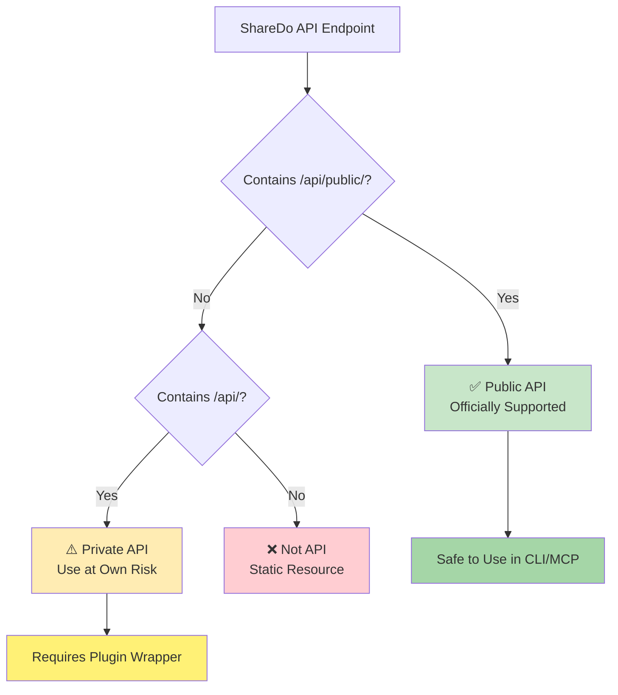
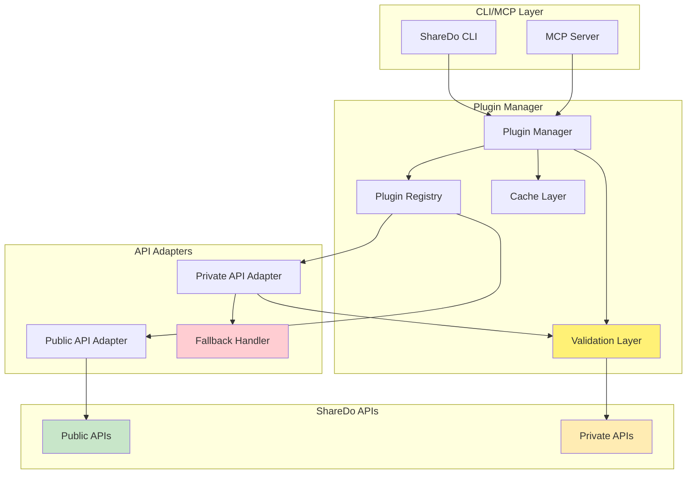

# ShareDo API Categorization & Plugin Architecture
## Public vs Private API Strategy for CLI & MCP Integration

### Version 1.0.0
### Date: 2025-08-28

---

## Executive Summary

This document establishes the critical distinction between ShareDo's public and private APIs, documents the risks associated with private API usage, and outlines a plugin architecture to safely expose private API capabilities when necessary. 

**Key Principles:**
- ✅ **Public APIs** (`/api/public/*`) are officially supported and should be used exclusively
- ⚠️ **Private APIs** (`/api/*` without public) carry significant risks and require special handling
- 🔌 **Plugin Architecture** provides controlled access to private API capabilities when absolutely necessary
- 🛡️ **Risk Mitigation** strategies protect against breaking changes and security vulnerabilities

---

## Table of Contents
1. [API Classification](#api-classification)
2. [Public APIs (Supported)](#public-apis-supported)
3. [Private APIs (Unsupported)](#private-apis-unsupported)
4. [Risk Assessment](#risk-assessment)
5. [Plugin Architecture](#plugin-architecture)
6. [Migration Strategy](#migration-strategy)
7. [Implementation Guidelines](#implementation-guidelines)

---

## API Classification

### Classification Rules



### API Categories

| Category | URL Pattern | Support Level | Risk Level | Usage |
|----------|-------------|---------------|------------|-------|
| **Public APIs** | `/api/public/v1/*`<br/>`/api/public/v2/*` | ✅ Full Support | Low | Direct CLI/MCP Integration |
| **Private Core APIs** | `/api/modeller/*`<br/>`/api/workflows/*`<br/>`/api/forms/*` | ⚠️ No Support | High | Plugin Wrapper Required |
| **Private Admin APIs** | `/api/listview/*`<br/>`/api/execution/*`<br/>`/api/IDE/*` | ⚠️ No Support | Critical | Special Permission Required |
| **Internal APIs** | `/api/internal/*`<br/>`/api/panels/*` | ❌ Never Use | Critical | Blocked |
| **Swagger Docs** | `/api/public/*/swagger.json` | ✅ Full Support | Low | Documentation Only |

---

## Public APIs (Supported)

### Officially Supported Public APIs

Based on analysis of the PublicAPIs.txt file, ShareDo provides **72 public API endpoints** across these categories:

#### Core Public APIs
```
✅ /api/public/accountAdjustments
✅ /api/public/attributes  
✅ /api/public/budgets
✅ /api/public/chartOfAccounts
✅ /api/public/chronology
✅ /api/public/comments
✅ /api/public/dms (Document Management)
✅ /api/public/documents
✅ /api/public/emails
✅ /api/public/features
✅ /api/public/findByQuery
✅ /api/public/genericExport
✅ /api/public/invoices
✅ /api/public/locations
✅ /api/public/my (Current User)
✅ /api/public/notifications
✅ /api/public/optionSets
✅ /api/public/organisation
✅ /api/public/participants
✅ /api/public/paymentRequests
✅ /api/public/people
✅ /api/public/phase
✅ /api/public/settings
✅ /api/public/smartVariables
✅ /api/public/time
✅ /api/public/timezones
✅ /api/public/types (Work Types)
✅ /api/public/users
✅ /api/public/wikis
✅ /api/public/workItem
✅ /api/public/workitem-audit
```

### Public API Guarantees
- **Stable Contracts**: Breaking changes require major version bump
- **Documentation**: Swagger/OpenAPI specs available
- **Support**: Official ShareDo support channels
- **SLA**: Production-level availability and performance
- **Security**: Regular security audits and patches

---

## Private APIs (Unsupported)

### Currently Used Private APIs

Based on the API_ENDPOINT_REFERENCE.md, the following private APIs are commonly used but NOT officially supported:

#### High-Risk Private APIs
```
⚠️ /api/modeller/types
⚠️ /api/modeller/types/{systemName}/aspect-sections
⚠️ /api/modeller/types/{systemName}/participant-roles
⚠️ /api/modeller/types/{systemName}/create-permissions
⚠️ /api/modeller/importexport/export/package
⚠️ /api/modeller/importexport/export/package/{jobId}/progress
⚠️ /api/modeller/changeTracking/entityHistoryDiff
⚠️ /api/workflows
⚠️ /api/workflows/{systemName}/execute
⚠️ /api/execution/plans/executing
⚠️ /api/forms
⚠️ /api/IDE/templates
⚠️ /api/listview/*
```

### Private API Risks
1. **Breaking Changes**: Can change without notice
2. **No Documentation**: Internal implementation details
3. **No Support**: ShareDo won't assist with issues
4. **Security Vulnerabilities**: May lack proper validation
5. **Performance Issues**: Not optimized for external use
6. **Legal Liability**: Violates terms of service

---

## Risk Assessment

### Risk Matrix for Private API Usage

| Risk Factor | Impact | Probability | Mitigation |
|-------------|--------|-------------|------------|
| **Breaking Changes** | Critical | High (90%) | Plugin abstraction layer |
| **Security Breach** | Critical | Medium (40%) | Additional validation layer |
| **Performance Degradation** | High | Medium (50%) | Caching and rate limiting |
| **Support Denial** | High | Certain (100%) | Maintain fallback options |
| **Data Corruption** | Critical | Low (20%) | Transaction wrapper |
| **Legal Issues** | Critical | Low (10%) | Clear documentation |

### Risk Scoring Formula
```
Risk Score = Impact (1-5) × Probability (0-1) × Exposure (1-5)

Where:
- Impact: Business impact if risk materializes
- Probability: Likelihood of occurrence
- Exposure: Frequency of API usage
```

---

## Plugin Architecture

### Plugin System Design



### Plugin Interface Definition

```typescript
interface IShareDoPlugin {
    // Plugin Metadata
    name: string;
    version: string;
    description: string;
    author: string;
    
    // API Configuration
    apiType: 'public' | 'private' | 'hybrid';
    requiredAPIs: string[];
    fallbackStrategy: 'cache' | 'public-api' | 'error';
    
    // Lifecycle Hooks
    initialize(): Promise<void>;
    validate(): Promise<boolean>;
    execute(params: any): Promise<any>;
    cleanup(): Promise<void>;
    
    // Error Handling
    onError(error: Error): Promise<void>;
    onAPIChange(change: APIChangeEvent): Promise<void>;
}

interface IPrivateAPIPlugin extends IShareDoPlugin {
    // Additional Requirements for Private APIs
    riskAcknowledgment: boolean;
    breakingChangeHandler: IBreakingChangeHandler;
    fallbackImplementation: IFallbackImplementation;
    
    // Monitoring
    trackUsage(): IUsageMetrics;
    reportHealth(): IHealthStatus;
}
```

### Example Plugin: Work Type Export

```typescript
class WorkTypeExportPlugin implements IPrivateAPIPlugin {
    name = 'WorkTypeExport';
    version = '1.0.0';
    apiType = 'hybrid';
    requiredAPIs = [
        '/api/modeller/types', // Private
        '/api/public/types'    // Public fallback
    ];
    
    async execute(params: { workType: string }) {
        try {
            // Try private API first (more features)
            return await this.usePrivateAPI(params);
        } catch (error) {
            // Fallback to public API
            console.warn('Private API failed, using public fallback');
            return await this.usePublicAPI(params);
        }
    }
    
    private async usePrivateAPI(params: any) {
        // Implementation with additional validation
        const response = await this.validateAndCall(
            '/api/modeller/types/' + params.workType,
            this.privateAPISchema
        );
        return this.transformPrivateResponse(response);
    }
    
    private async usePublicAPI(params: any) {
        // Safe public API implementation
        const response = await fetch(
            '/api/public/v2/types/' + params.workType
        );
        return this.transformPublicResponse(response);
    }
}
```

---

## Migration Strategy

### Phase 1: Inventory (Week 1)
```typescript
// Scan codebase for private API usage
const privateAPIUsage = [
    {
        api: '/api/modeller/types',
        usage: 'Work type configuration',
        publicAlternative: '/api/public/v2/types',
        migrationComplexity: 'medium',
        priority: 'high'
    },
    {
        api: '/api/workflows',
        usage: 'Workflow execution',
        publicAlternative: 'None - requires plugin',
        migrationComplexity: 'high',
        priority: 'critical'
    }
];
```

### Phase 2: Plugin Development (Week 2-3)
1. Create plugins for critical private APIs
2. Implement fallback strategies
3. Add comprehensive error handling
4. Create monitoring dashboard

### Phase 3: Testing (Week 4)
1. Test plugin resilience to API changes
2. Validate fallback mechanisms
3. Performance benchmarking
4. Security audit

### Phase 4: Deployment (Week 5)
1. Deploy plugin infrastructure
2. Monitor usage patterns
3. Collect metrics
4. Document issues

---

## Implementation Guidelines

### CLI Integration

```typescript
// sharedo-cli/src/plugins/PluginManager.ts
export class PluginManager {
    private plugins: Map<string, IShareDoPlugin> = new Map();
    private riskRegistry: RiskRegistry = new RiskRegistry();
    
    async loadPlugin(pluginPath: string): Promise<void> {
        const plugin = await import(pluginPath);
        
        // Validate plugin
        if (plugin.apiType === 'private') {
            await this.validatePrivateAPIPlugin(plugin);
            this.riskRegistry.register(plugin);
        }
        
        // Initialize with safety checks
        await plugin.initialize();
        this.plugins.set(plugin.name, plugin);
    }
    
    async execute(pluginName: string, params: any): Promise<any> {
        const plugin = this.plugins.get(pluginName);
        
        if (!plugin) {
            throw new Error(`Plugin ${pluginName} not found`);
        }
        
        // Track usage for monitoring
        this.trackUsage(plugin, params);
        
        try {
            return await plugin.execute(params);
        } catch (error) {
            // Handle with fallback strategy
            return await this.handlePluginError(plugin, error, params);
        }
    }
}
```

### MCP Server Integration

```typescript
// sharedo-mcp/src/tools/PluginTool.ts
export class PluginTool implements MCPTool {
    name = 'sharedo_plugin_execute';
    description = 'Execute ShareDo plugin with safety checks';
    
    inputSchema = {
        type: 'object',
        properties: {
            plugin: { type: 'string' },
            params: { type: 'object' },
            allowPrivateAPI: { type: 'boolean', default: false }
        },
        required: ['plugin', 'params']
    };
    
    async execute(input: any): Promise<any> {
        if (input.allowPrivateAPI) {
            // Require explicit acknowledgment
            await this.acknowledgeRisk(input.plugin);
        }
        
        return await pluginManager.execute(input.plugin, input.params);
    }
}
```

---

## Risk Acknowledgment Template

```markdown
# Private API Usage Risk Acknowledgment

## Plugin: {PluginName}
## Private APIs Used: {APIList}

By using this plugin, you acknowledge:

1. **No Support**: ShareDo provides NO support for private API usage
2. **Breaking Changes**: APIs may change without notice
3. **Security Risk**: Private APIs may have security vulnerabilities
4. **Performance Impact**: May cause performance degradation
5. **Legal Compliance**: Usage may violate terms of service

## Mitigation Measures Implemented:
- ✅ Fallback to public API when available
- ✅ Comprehensive error handling
- ✅ Usage monitoring and alerting
- ✅ Regular compatibility testing
- ✅ Documentation of dependencies

Acknowledged by: ________________
Date: ________________
```

---

## Monitoring & Alerting

### Plugin Health Dashboard

```typescript
interface IPluginHealthMetrics {
    pluginName: string;
    privateAPIsUsed: string[];
    lastSuccess: Date;
    lastFailure: Date;
    failureRate: number;
    averageResponseTime: number;
    fallbackUsageRate: number;
    riskScore: number;
}

// Monitor critical metrics
const alertThresholds = {
    failureRate: 0.1,        // Alert if >10% failures
    responseTime: 5000,      // Alert if >5 seconds
    fallbackRate: 0.5,       // Alert if >50% fallback usage
    riskScore: 7             // Alert if risk score >7
};
```

---

## Recommendations

### Immediate Actions
1. **Audit Current Usage**: Identify all private API usage in codebase
2. **Prioritize Migration**: Focus on high-risk private APIs first
3. **Implement Plugin System**: Start with critical private APIs
4. **Document Everything**: Maintain clear documentation of risks

### Best Practices
1. **Always prefer public APIs** when available
2. **Never use internal APIs** (`/api/internal/*`)
3. **Implement comprehensive fallbacks** for private APIs
4. **Monitor usage patterns** continuously
5. **Plan for API deprecation** proactively

### Future Considerations
1. **Request public API additions** for critical functionality
2. **Contribute to ShareDo API development** where possible
3. **Build abstraction layers** to minimize API coupling
4. **Maintain API compatibility matrix** for each release

---

## Conclusion

The distinction between public and private ShareDo APIs is critical for building reliable, maintainable integrations. While public APIs should always be the first choice, the plugin architecture provides a controlled, monitored way to access private API functionality when absolutely necessary.

By following this architecture and guidelines:
- **Risk is minimized** through abstraction and fallbacks
- **Monitoring ensures** early detection of issues
- **Documentation provides** clear understanding of trade-offs
- **Plugin system enables** controlled private API access

The CLI and MCP implementations should strictly adhere to these guidelines to ensure long-term stability and supportability of the ShareDo integration platform.